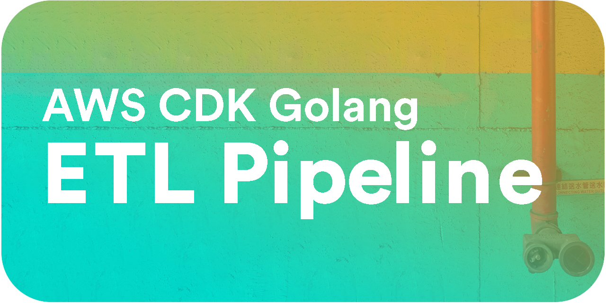
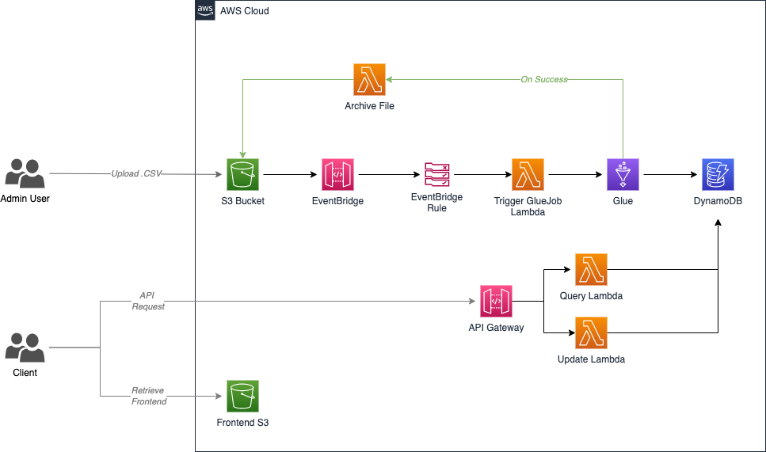
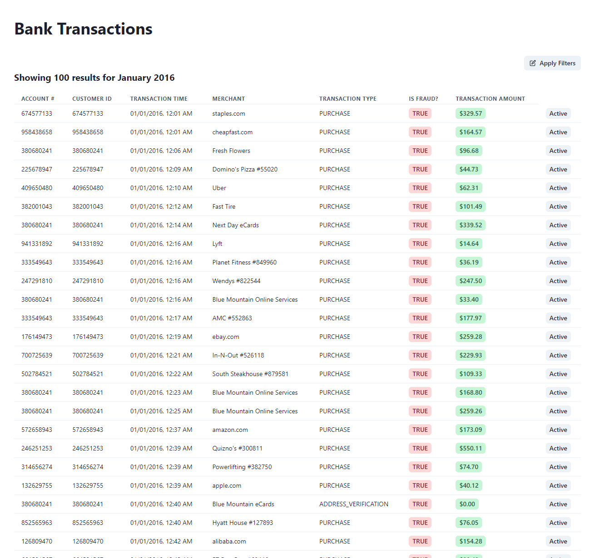
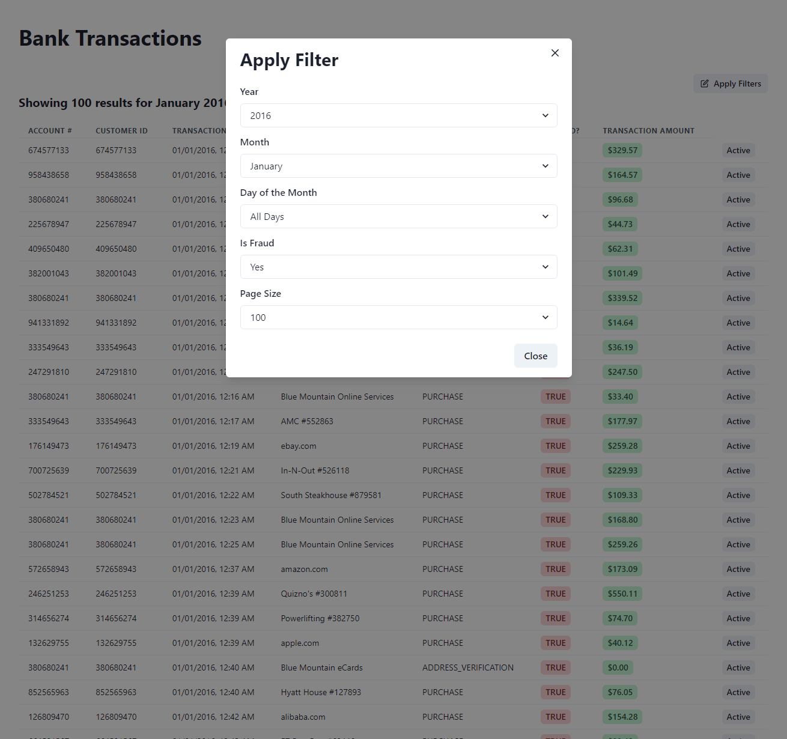
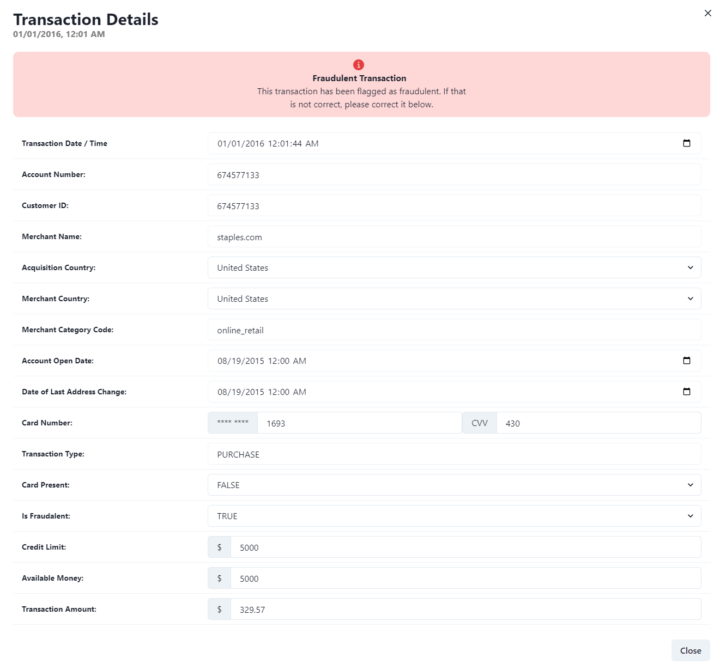

## Architecture


## Overview
The AWS ETL (Extract, Transform, Load) pipeline described here is designed to efficiently process banking data in CSV format. The pipeline automates the transformation and loading of this data into a DynamoDB table for further analysis, *in this case for the sake of example, we are using mock banking data*. It leverages various AWS services such as S3, Lambda, and Glue to provide a scalable and reliable solution.

1. Data Ingestion:
    - The pipeline starts when a CSV file containing banking data is uploaded to the specified S3 bucket.
    - The CSV file should be placed in the input/ directory within the S3 bucket.

2. Triggering Lambda through S3 Event:
    - An S3 event notification is set up to detect the new file upload in the input/ directory.
    - The S3 event triggers a Lambda function responsible for orchestrating the ETL pipeline.

3. Glue Job Execution:
    - The Lambda function initiates the execution of a Glue Job, a fully managed ETL service provided by AWS.
    - The Glue Job reads the CSV file from the S3 bucket and performs the necessary data transformations.
    - The transformed data is then loaded into the specified DynamoDB table.

4. Completion Notification:
    - After the Glue Job finishes processing and loading the data, it triggers another Lambda function.

5. CSV Archive:
    - The Lambda function moves the processed CSV file from the input/ directory to the archive/ directory within the same S3 bucket.
    - This archival step helps maintain a clean and organized storage of processed files.

6. API Gateway Integration:
    - An API Gateway is set up to provide an interface for the React frontend to interact with the ETL pipeline.
    - The API Gateway has two routes:
        - Query Route: This route is associated with a Query Lambda function. It allows the frontend to retrieve processed data from the DynamoDB table.
        - Update Route: This route is associated with an Update Lambda function. It enables the frontend to update or modify data in the DynamoDB table.

7. React Frontend Integration:
    - The React frontend, hosted in an S3 bucket, communicates with the API Gateway to fetch data and perform updates.
    - The frontend can make requests to the API Gateway's query and update routes, triggering the respective Lambda functions.

## React Frontend



*Screenshot 1: The home of the react frontend, with a subset of the sample data displayed, roughly 250,000 transactions--the largest size I can upload to GitHub without using LFS.*



*Screenshot 2: The react frontend allows the user to filter the data by month and year.*



*Screenshot 3: The react frontend allows the user to update the fraud status of a transaction.*


*GIF 1: An animated gif of the react frontend in action.*

## Setup
### Pre-Requisites
It is expected that you have familiarity with AWS API Gateway, AWS Glue, AWS Lambda, AWS S3 prior to this project.

Additionally, you will need the following tools installed on your system:
- [AWS CDK](https://docs.aws.amazon.com/cdk/latest/guide/getting_started.html)
- [AWS CLI](https://docs.aws.amazon.com/cli/latest/userguide/cli-chap-install.html)
- [Node 18.x](https://nodejs.org/en/download/)
- [Go 1.18.x](https://golang.org/doc/install)
- [jq](https://stedolan.github.io/jq/download/)

### Install Dependencies

1. First, make sure you have the latest version of the AWS CDK CLI installed via npm.
```sh
npm install -g aws-cdk
```

2. Now, you will need to install the Go compiler toolchain (>= 1.16). You can find setup instructions for your specific system at the following link: [https://go.dev/dl/](https://go.dev/dl/)

Congrats! You can ready to start setting up the project itself.

## Deployment Manual

To deploy the full stack, perform the following steps:

1. Run `cdk synth -c name=<your-project-name>` to sythensize your stack. Please review this to ensure it is creating what is expected.

2. Once you have reviewed the previous step, you can now deploy the stack by running `cdk deploy -c name=<your-project-name>`

## Deployment Script
To deploy the fullstack with helper script, simply run the following steps:

1. Update `STACK_NAME` in `deploy.sh`

2. Run `deploy.sh`
```sh
./deploy.sh
```

## Testing

To kick off the ETL pipeline, you will need to upload the sample data to the S3 bucket. You can upload the sample data by running the following command:
```sh
aws s3 cp ./backend/sample_data/bank_data.csv s3://<your-bucket-name>/input/bank_data.csv
```

## Sample API Request

### GET
Request:
```sh
curl --location --request GET '<your-api-stage-endpoint>/transactions?month=august&year=2016'
```

Response:
```json
[
    {
        "accountNumber": "737265056",
        "customerId": "737265056",
        "creditLimit": "5000",
        "availableMoney": 5000,
        "transactionDateTime": "2016-08-13 14:27:32.0",
        "transactionAmount": 98.55,
        "merchantName": "Uber",
        "acqCountry": "US",
        "merchantCountryCode": "US",
        "posEntryMode": "2",
        "posConditionCode": 1,
        "merchantCategoryCode": "rideshare",
        "currentExpDate": "23-Jun",
        "accountOpenDate": "2015-03-14 00:00:00.0",
        "dateOfLastAddressChange": "2015-03-14 00:00:00.0",
        "cardCVV": 414,
        "cardLast4Digits": 1803,
        "transactionType": "PURCHASE",
        "currentBalance": 0,
        "cardPresent": "FALSE",
        "isFraud": "TRUE",
        "countryCode": "US"
    }
]
```

### GET
Request:
```sh
curl --location --request PUT '<your-api-stage-endpoint>/transactions/8590209014' \
--header 'Content-Type: application/json' \
--data-raw '{
    "id": 8590209014,
    "accountNumber": "419104777",
    "customerId": "419104777",
    "creditLimit": "50000",
    "availableMoney": 50000,
    "transactionDateTime": "2016-01-01 00:01:02.0",
    "transactionAmount": 44.5,
    "merchantName": "Washington Post",
    "acqCountry": "US",
    "merchantCountryCode": "US",
    "posEntryMode": "9",
    "posConditionCode": 1,
    "merchantCategoryCode": "subscriptions",
    "currentExpDate": "28-Mar",
    "accountOpenDate": "2015-05-30 00:00:00.0",
    "dateOfLastAddressChange": "2015-05-30 00:00:00.0",
    "cardCVV": 837,
    "cardLast4Digits": 5010,
    "transactionType": "PURCHASE",
    "currentBalance": 0,
    "cardPresent": "FALSE",
    "isFraud": "FALSE",
    "countryCode": "US"
}'
```

Request Body:
```json
Item updated successfully
```

## Useful Commands

 * `cdk deploy`      deploy this stack to your default AWS account/region
 * `cdk diff`        compare deployed stack with current state
 * `cdk synth`       emits the synthesized CloudFormation template
 * `go test`         run unit tests